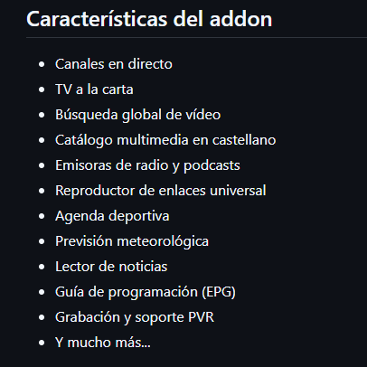

# EspaTV - Repositorio para Kodi

<video src="Animacion_Logo_EspaTV.mp4" width="100%" controls>
</video>

## Descripción

Repositorio oficial del addon **EspaTV** para Kodi. Permite instalar y actualizar automáticamente el addon desde Kodi.

## Instalación

### Opción 1: Desde el Administrador de Archivos de Kodi (Recomendado)

1. Abre Kodi y ve a **Ajustes** > **Administrador de archivos** > **Añadir fuente**
2. Introduce la URL: `https://espakodi.github.io/espatv/`
3. Ponle un nombre (por ejemplo, `EspaTV Repo`)
4. Ve a **Ajustes** > **Addons** > **Instalar desde archivo ZIP**
5. Selecciona la fuente `EspaTV Repo` y elige `repository.espatv-1.0.0.zip`
6. Espera la notificación de instalación
7. Ve a **Instalar desde repositorio** > **EspaTV Repository** > **Addons de vídeo** > **EspaTV**

### Opción 2: Instalación manual mediante archivo ZIP

1. Descarga `repository.espatv-1.0.0.zip` desde este repositorio
2. En Kodi, ve a **Ajustes** > **Addons** > **Instalar desde archivo ZIP**
3. Navega hasta el archivo descargado y selecciónalo

  

## Contacto y Soporte

- GitHub: [github.com/espakodi](https://github.com/espakodi)
- Telegram: [t.me/espakodi](https://t.me/espakodi)

---

> [!NOTE]
> **Sobre la Creación de Contenido y Legalidad del Addon**  
> EspaTV no aloja contenido ni vulnera ninguna medida de protección de derechos de autor. EspaTV es, legal y técnicamente, un agregador, buscador, y explorador multimedia de fuentes públicas, gratuitas y de libre emisión disponibles en internet.
> 
> Tienes plena libertad para mencionar EspaTV y difundir contenido relacionado con el addon en cualquier medio o plataforma pública.
